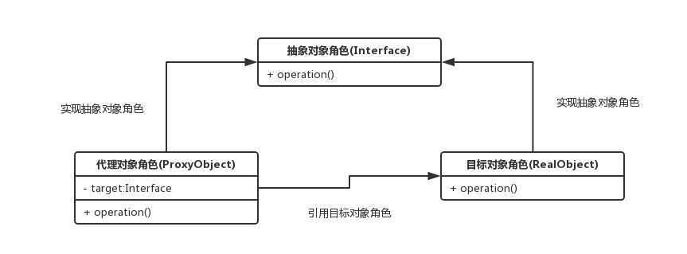

# 代理设计模式

	>代理分为静态代理和动态代理。

* 静态代理
* 动态代理

> 代理模式中的角色：

* 1.抽象对象角色(接口)

声明了目标类及代理类对象的共同接口，这样在任何可以使用目标对象的地方都可以使用代理对象。

* 2.目标对象角色(委托类)

定义了代理对象所代表的目标对象。

* 3.代理对象角色(代理类)

代理对象内部含有目标对象的引用，从而可以在任何时候操作目标对象；代理对象和目标对象具有统一的接口，以便可以再任何时候替代目标对象。代理对象通常在客户端调用传递给目标对象之前或者之后，执行某些操作，而非单纯的将调用传递给目标对象。

> 代理模式中对象关系图




## 静态代理

### 静态代理的实现


### 静态代理的优缺点

> 优点

​	代理使客户端不需要知道实现类是什么，怎么做的，而客户端只需知道代理即可（解耦合）

> 缺点

* 代理类和委托类实现了相同的接口，代理类通过委托类实现了相同的方法。这样就出现了大量的代码重复。如果接口增加一个方法，除了所有实现类需要实现这个方法外，所有代理类也需要实现此方法。增加了代码维护的复杂度。
* 代理对象只服务于一种类型的对象，如果要服务多类型的对象。势必要为每一种对象都进行代理，静态代理在程序规模稍大时就无法胜任了。

==举例说明：代理可以对实现类进行统一的管理，如在调用具体实现类之前，需要打印日志等信息，这样我们只需要添加一个代理类，在代理类中添加打印日志的功能，然后调用实现类，这样就避免了修改具体实现类。满足我们所说的开闭原则。但是如果想让每个实现类都添加打印日志的功能的话，就需要添加多个代理类，以及代理类中各个方法都需要添加打印日志功能（如上的代理方法中删除，修改，以及查询都需要添加上打印日志的功能）==

==即静态代理类只能为特定的接口(Service)服务。如想要为多个接口服务则需要建立很多个代理类。==

## 动态代理

### 动态代理的实现

#### JDK实现动态代理

> 实现代码

```java
package club.javalearn.pattern.proxy;

/**
 *
 * @author king-pan
 * Date: 2018-12-08
 * Time: 23:31
 * Description: 租房
 */
public interface Tenementable {

    /**
     * 租房
     */
    public void tenement();
}
```


```java
package club.javalearn.pattern.proxy.staticed;

import club.javalearn.pattern.proxy.Tenementable;

/**
 *
 * @author king-pan
 * Date: 2018-12-08
 * Time: 23:33
 * Description: 租房房客,自己租房子麻烦，找黑心的LinkHome，把要求告诉LinkHome
 */
public class Lodget implements Tenementable {


    @Override
    public void tenement() {
        System.out.println("我的要求: 一室一厅，独门独户，距离【光谷广场地铁】一公里以内，价格不超过1000元");
    }
}
```


```java
package club.javalearn.pattern.proxy.staticed;

import club.javalearn.pattern.proxy.Tenementable;

/**
 *
 * @author king-pan
 * Date: 2018-12-08
 * Time: 23:31
 * Description: LinkHome租房中介公司
 */
public class LinkHome implements Tenementable {

    private Tenementable target;

    public LinkHome(Tenementable target){
        this.target = target;
    }

    @Override
    public void tenement() {
        System.out.println("欢迎选择链家,请告诉您的诉求");
        target.tenement();
        System.out.println("正在紧急给你查找房源......请稍后");
        System.out.println("已为您找到房源，请签订合同");
    }
}
```


```java
package club.javalearn.pattern.proxy.jkd;

import club.javalearn.pattern.proxy.Tenementable;

import java.lang.reflect.InvocationHandler;
import java.lang.reflect.Method;
import java.lang.reflect.Proxy;

/**
 *
 * @author king-pan
 * Date: 2018-12-08
 * Time: 23:46
 * Description: 静态代理相当于是个人中介，一对一服务，现实中都是一个门店服务很多个租房客.
 * <p>
 * 这种情况下就需要用到了动态代理.
 * 1. 动态代理的应用: 标准化
 * 2.
 */
public class JDKLinkHome implements InvocationHandler {

    private Tenementable target;


    public Object getInstance(Tenementable target) {
        this.target = target;
        Class<?> clz = target.getClass();
        //用来生成一个新的对象（字节码重组来实现）
        return Proxy.newProxyInstance(clz.getClassLoader(), clz.getInterfaces(), this);

    }

    @Override
    public Object invoke(Object proxy, Method method, Object[] args) throws Throwable {
        System.out.println("LinkHome: 欢迎来到LinkHome，我们竭诚为您服务");
        System.out.println("LinkHome: 请提供您的要求");
        method.invoke(this.target, args);
        System.out.println("LinkHome：为您找到了合适的房源");
        System.out.println("LinkHome: 期待下次为您服务");
        return null;
    }
}
```

测试代码

```java
package club.javalearn.pattern.proxy.test;

import club.javalearn.pattern.proxy.Tenementable;
import club.javalearn.pattern.proxy.jkd.JDKLinkHome;
import club.javalearn.pattern.proxy.staticed.Lodget;
import sun.misc.ProxyGenerator;

import java.io.FileOutputStream;

/**
 *
 * @author king-pan
 * Date: 2018-12-08
 * Time: 23:52
 * Description: JDK动态代理测试类
 */
public class JDKLinkHomeTest {

    public static void main(String[] args) {
        Tenementable tenementable = (Tenementable)new JDKLinkHome().getInstance(new Lodget());
        System.out.println("JDK动态代理的类名称: " + tenementable.getClass());
        tenementable.tenement();


        //原理：
        //1、拿到被代理对象的引用，并且获取到它的所有的接口，反射获取
        //2、JDK Proxy类重新生成一个新的类、同时新的类要实现被代理类所有实现的所有的接口
        //3、动态生成Java代码，把新加的业务逻辑方法由一定的逻辑代码去调用（在代码中体现）
        //4、编译新生成的Java代码.class
        //5、再重新加载到JVM中运行
        //以上这个过程就叫字节码重组

        //JDK中有个规范，只要要是$开头的一般都是自动生成的

        //通过反编译工具可以查看源代码
        byte [] bytes = ProxyGenerator.generateProxyClass("$Proxy0",new Class[]{Tenementable.class});
        FileOutputStream os = null;
        try {
            os = new FileOutputStream("./$Proxy0.class");
            os.write(bytes);
            os.close();
        } catch (Exception e) {
            e.printStackTrace();
        }


    }
}
```


> 原理： 

* 1、拿到被代理对象的引用，并且获取到它的所有的接口，反射获取
* 2、JDK Proxy类重新生成一个新的类、同时新的类要实现被代理类所有实现的所有的接口 
* 3、动态生成Java代码，把新加的业务逻辑方法由一定的逻辑代码去调用（在代码中体现） 
* 4、编译新生成的Java代码.class 
* 5、再重新加载到JVM中运行 以上这个过程就叫字节码重组

==JDK中有个规范，只要要是$开头的一般都是自动生成的==

> JDK动态代理必须是接口的原因

通过反编译获取JDK动态代理动态生成的代码

```java
//
// Source code recreated from a .class file by IntelliJ IDEA
// (powered by Fernflower decompiler)
//

import club.javalearn.pattern.proxy.Tenementable;
import java.lang.reflect.InvocationHandler;
import java.lang.reflect.Method;
import java.lang.reflect.Proxy;
import java.lang.reflect.UndeclaredThrowableException;

public final class $Proxy0 extends Proxy implements Tenementable {
    private static Method m1;
    private static Method m2;
    private static Method m3;
    private static Method m0;

    public $Proxy0(InvocationHandler var1) throws  {
        super(var1);
    }

    public final boolean equals(Object var1) throws  {
        try {
            return (Boolean)super.h.invoke(this, m1, new Object[]{var1});
        } catch (RuntimeException | Error var3) {
            throw var3;
        } catch (Throwable var4) {
            throw new UndeclaredThrowableException(var4);
        }
    }

    public final String toString() throws  {
        try {
            return (String)super.h.invoke(this, m2, (Object[])null);
        } catch (RuntimeException | Error var2) {
            throw var2;
        } catch (Throwable var3) {
            throw new UndeclaredThrowableException(var3);
        }
    }

    public final void tenement() throws  {
        try {
            super.h.invoke(this, m3, (Object[])null);
        } catch (RuntimeException | Error var2) {
            throw var2;
        } catch (Throwable var3) {
            throw new UndeclaredThrowableException(var3);
        }
    }

    public final int hashCode() throws  {
        try {
            return (Integer)super.h.invoke(this, m0, (Object[])null);
        } catch (RuntimeException | Error var2) {
            throw var2;
        } catch (Throwable var3) {
            throw new UndeclaredThrowableException(var3);
        }
    }

    static {
        try {
            m1 = Class.forName("java.lang.Object").getMethod("equals", Class.forName("java.lang.Object"));
            m2 = Class.forName("java.lang.Object").getMethod("toString");
            m3 = Class.forName("club.javalearn.pattern.proxy.Tenementable").getMethod("tenement");
            m0 = Class.forName("java.lang.Object").getMethod("hashCode");
        } catch (NoSuchMethodException var2) {
            throw new NoSuchMethodError(var2.getMessage());
        } catch (ClassNotFoundException var3) {
            throw new NoClassDefFoundError(var3.getMessage());
        }
    }
}
```

看下类定义: public final class $Proxy0 extends Proxy implements Tenementable

JDK动态代理生成的代理类，自动实现了Tenementable接口.


#### CGLIB实现动态代理


## 代理模式的使用场景

如果已有的方法在使用的时候需要对原有的方法进行改进，此时有两种办法：

（1）修改原有的方法来适应。显然这违反了“对扩展开放，对修改关闭”的原则。

（2）采用一个代理类调用原来的方法，且对产生的结果进行控制。这就是代理模式了。

使用代理模式可以将功能划分的更加清晰，有助于后期的维护。

以上所说的这种代理模式称为静态代理。

##  扩展

Spring框架是时下很流行的Java开源框架，Spring之所有如此流行，跟它自身的特性是分不开的。Spring本身含有两大特性，一个是IOC，一个是AOP的支持。

IOC是Inverse Of Control，即控制反转，也有人把IOC称作依赖注入。我觉得依赖注入这种说法很好理解，但不完全对。依赖注入是Dependency Injection的缩写，是实现IOC的一种方法，但不等同于IOC，IOC是一种思想，DI只是一种实现。

AOP是Aspect Oriented Programming的缩写，即面向切面编程。与面向过程和面向对象的编程方式相比，面向切面编程提供了一种全新的思路，解决了OOP编程过程中的一些痛点。

IOC的实现原理是利用了JAVA的反射技术，那么AOP的实现原理是什么呢？——动态代理技术

目前动态代理技术主要分为Java自己提供的JDK动态代理技术和CGLIB技术。Java自带的JDK动态代理技术是需要接口的，而CGLIB则是直接修改字节码。


 