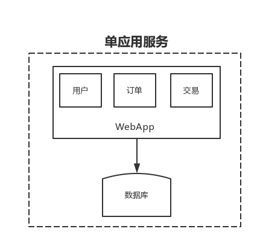
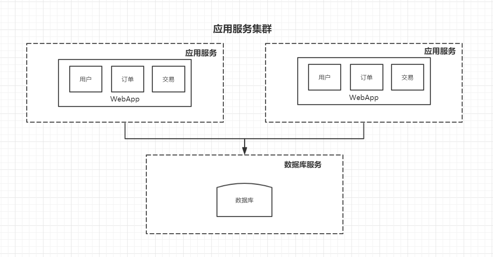
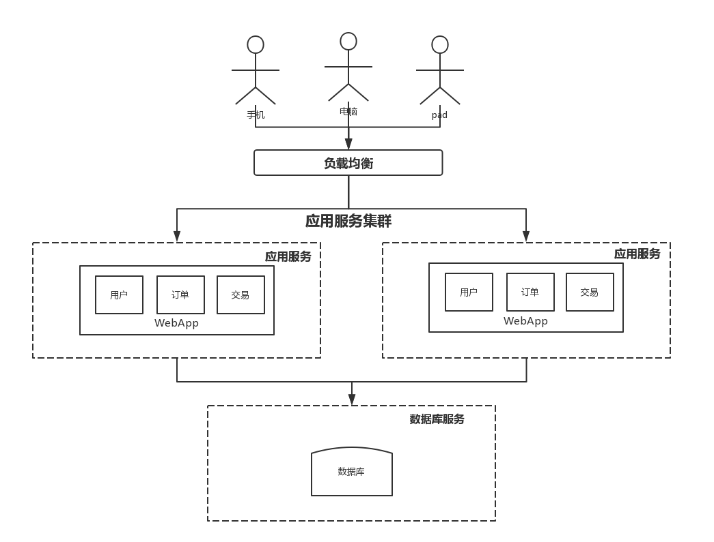
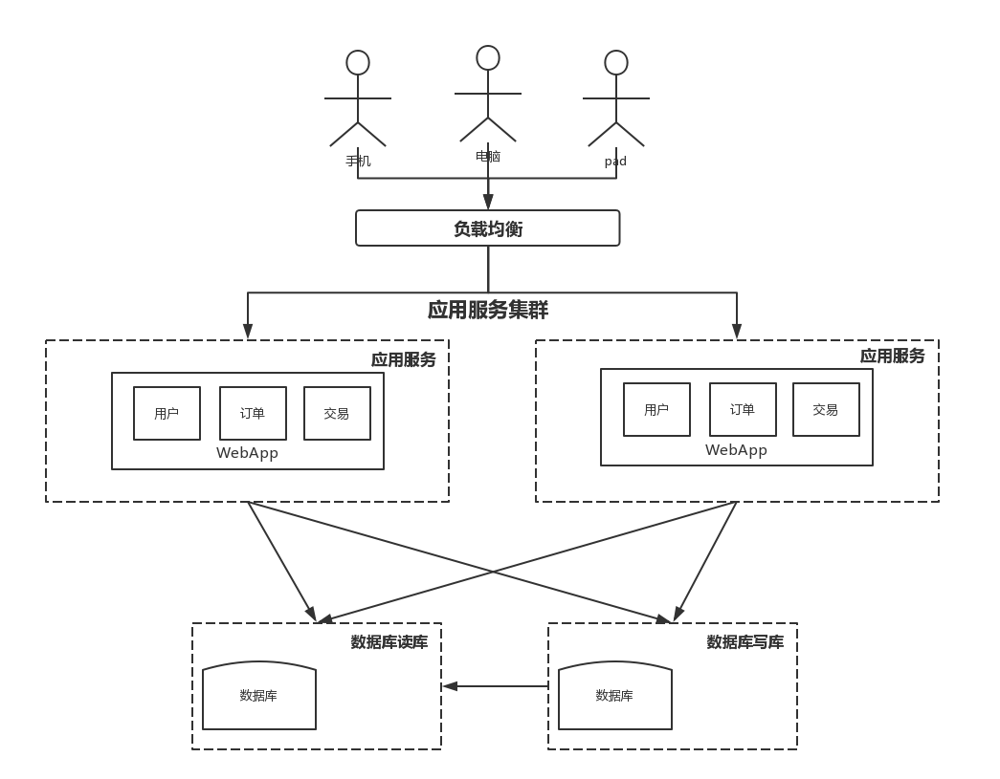
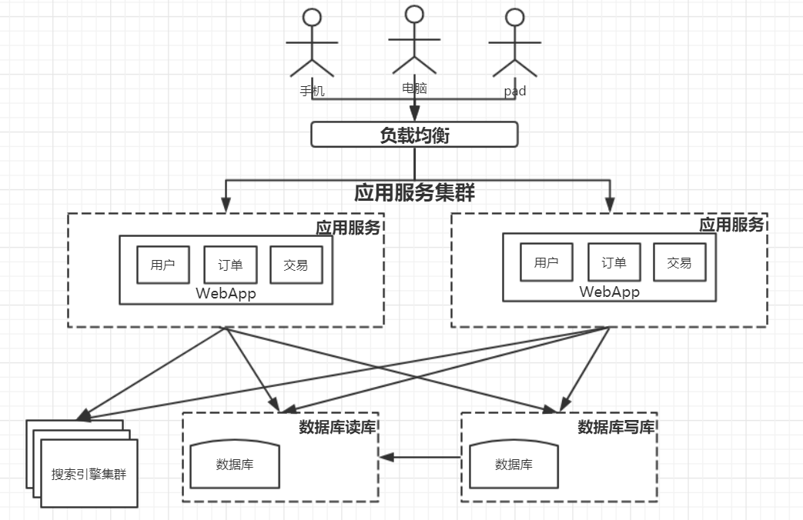
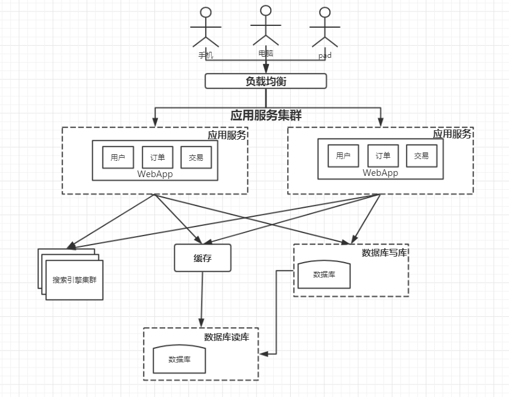
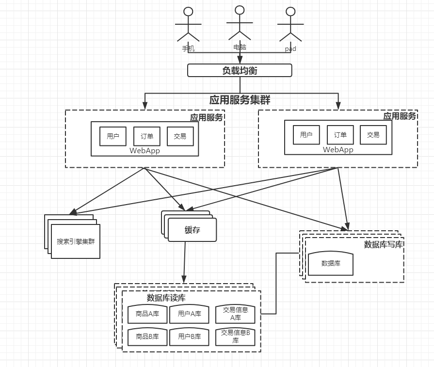
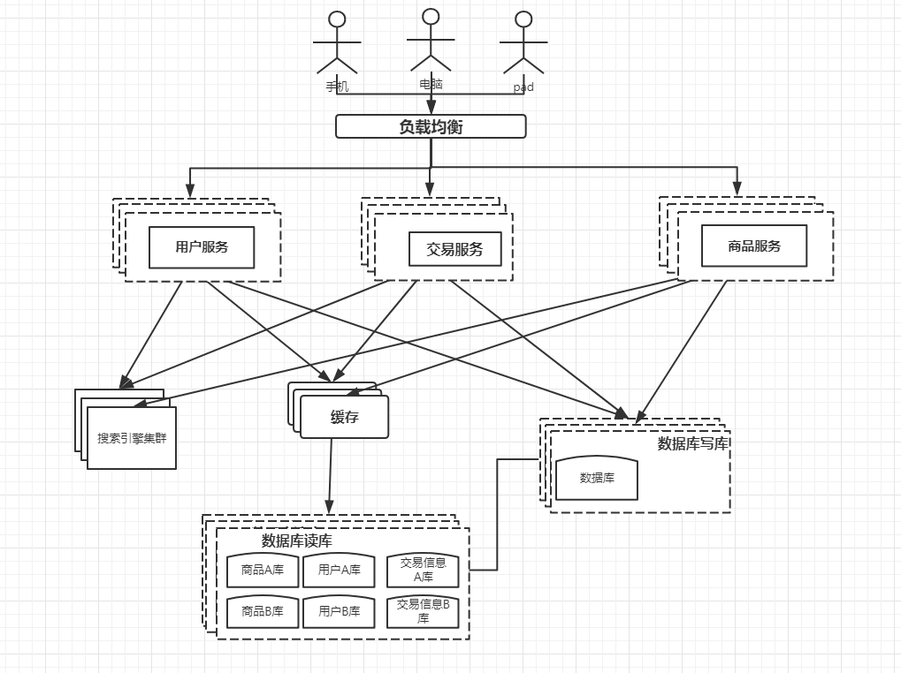

# 分布式架构演进过程


我们以 javaweb 为例，来搭建一个简单的电商系统，从这个系 统中来看系统的演变历史;要注意的是，接下来的演示模型， 关注的是数据量、访问量提升，网站结构发生的变化， 而不是 具体关注业务功能点。其次，这个过程是为了让大家更好的了 解网站演进过程中的一些问题和应对策略。 假如我们系统具备以下功能: 

```java
用户模块:用户注册和管理
商品模块:商品展示和管理
交易模块:创建交易及支付结算
```

​	==系统架构之间实际上是没有优缺点的，只有适合不适合，下文中分析的优缺点，只是相对而言。==

​	==每种架构都会有各种优缺点，当符合业务要求的优点大于缺点时，那么该中系统架构就是有意义的，不能单方面的看优缺点。==


## 1、单应用架构

### 1.1、单应用架构图



### 1.2、单应用架构的优缺点

> 优点

1. 开发、部署、维护简单
2. 受IO/和网络的限制少
3. 系统架构简单明了，功能扩展简单


> 缺点

1. 单节点服务没有保障，出现一个问题就会导致整个应用不能使用
2. 应用服务和数据库服务都部署在一台服务器上，主机性能差
3. 访问量小

## 2、应用服务器和数据库服务器分离


### 2.1、系统架构图


### 2.2、应用服务器和数据库服务器分离的优缺点

> 有点

1. 两台服务器比一台服务器性能提供了很多
2. 数据库和应用分离，容灾能力提升。
3. 提升访问量

> 缺点

1. 硬件资源成本提升


## 3、应用服务器集群


### 3.1、系统架构图



### 3.2、应用服务器集群的优缺点

> 优点

1. 部署了多个应用服务，容灾能力提升，一台服务器挂掉了还有其他的应用服务
2. 访问量相对于《应用服务和数据库服务分离》有很大的提升
3. 可以横向的添加应用服务器扩展

> 缺点

1. 多个应用服务，session管理问题，引入新的问题
2. 性能瓶颈可能在数据库上
3. 多台应用服务器，选择分配请求哪台应用服务器处理请求(负载均衡)

### 3.3、负载均衡的应用服务器集群




## 4、数据库读写分离

​	应用服务器通过集群横向扩展可以提升 应用服务的能力，但是相对于应用服务的横向扩展，数据库的压力越来越大了，这样就会制约着整个系统的性能，可能导致整体的性能不如上面几种架构，这样就迫切的从数据库方法提升性能。

### 4.1、系统架构图




### 4.2 、数据库读写分离的优缺点

> 优点

1. 相对于《负载均衡的应用集群架构》，解决了数据库性能瓶颈，
2. 能够大幅度的提升系统并发量和处理能力

> 缺点

1. 数据库之间数据的同步
2. 数据库的事务管理

## 5、搜索引擎


### 5.1、系统架构图

 


### 5.2、优缺点

> 优点

1. 提升查询效率，解决了数据库查询慢的问题

> 缺点

1. 之前所有的数据都存储到数据库中，现在部分数据放入搜索引擎中，需要业务切分
2. 放入数据库的部分数据的查询速度还是没有提升


## 6、缓存技术


### 6.1、系统架构图




### 6.2、优缺点

> 优点

1. 缓存提升了数据库部分数据的查询效率
2. 缓解了高频次的数据库查询

> 缺点

1. 引入新的问题:缓存管理（数据更新操作导致缓存失效）


## 7、分库分表

​	当业务记录到一定时候，单表数据量达到千万级以上，数据库的查询效率就会很低很低。

​	垂直拆分：把数据库中不同业务数据拆分到不同的数据库

​	水平拆分：把同一个表中的数据拆分到两个甚至跟多的数据库中，水平拆分的原因是某些业务数据量已经达到了单个数据库的瓶颈，这时可以采取讲表拆分到多个数据库中。

### 7.1、系统架构图



### 7.2、优缺点

> 优点

1. 单表查询速度快

> 缺点

1. 多表查询速度慢
2. 联合查询速度慢
3. 编程难度增加

## 8、业务拆分

### 8.1、系统架构图



### 8.2、优缺点

> 优点

1. 解耦，提升单个服务的性能

> 缺点

1. 维护麻烦
2. 分布式事务管理


## 9、其他

> 集群与分布式的区别

```
1. 集群是同一应用部署在不同的服务器上,应用之间没有关联
2. 分布式是不同应用部署在不同的服务器上，应用之间相互调用,不同的应用之间有关联
```


