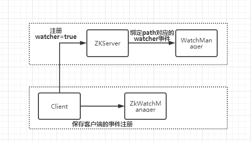

# Zookeeper实践

## 数据存储

​	事务日志: datadir目录中

​	快照日志: datadir目录中

​	运行时日志： bin/zookeeper.out

## 基于JavaApi初探zookeeper的使用

### Zookeeper连接

​	zookeeper的状态有: NOT_CONNECT、CONNECTING、CONNECTED、CLOSE

> no watch连接

```java
   @Test
    public void test() {
        try {
            ZooKeeper zooKeeper = new ZooKeeper("47.92.72.146:2181", 4000000, null);
            System.out.println(zooKeeper.getState());//connecting
            Thread.sleep(1000);
            System.out.println(zooKeeper.getState());//connected
            zooKeeper.close();
        } catch (Exception e) {
            e.printStackTrace();
        }
    }
```

由于没有watch监听zookeeper的连接状态的变化，所以只能使用线程睡眠的方式，但是状态不一定是connected,如果服务端网络有延迟，从CONNECTING到CONNECTED状态转换超过设置的睡眠时间，那么第二次的状态输出的就不是COONECTED、所以引入了Watch时间，来监听zookeeper的连接状态

> watch连接

```java
@Test
    public void test() {
        final CountDownLatch countDownLatch = new CountDownLatch(1);
        try {
            ZooKeeper zooKeeper = new ZooKeeper("47.92.72.146:2181", 4000, new 		                 Watcher() {
                @Override
                public void process(WatchedEvent event) {
                    System.out.println("默认事件:" + event.getType());
                    if (Event.KeeperState.SyncConnected == event.getState()) {
                        //如果收到服务端的响应事件，连接成功
                        countDownLatch.countDown();
                    }
                }
            });
            countDownLatch.await();
        } catch (Exception e) {
            e.printStackTrace();
        }
    }
```

> 创建节点、修改节点、删除节点

```java
 @Test
    public void createTest() {
        try {
            //创建节点: 第一个参数节点名称，第二个参数节点值的byte数组，第三个参数，权限，第四个参数节点类型
            zooKeeper.create("/zk-king", "king-pan".getBytes(), ZooDefs.Ids.OPEN_ACL_UNSAFE, CreateMode.PERSISTENT);

            Thread.sleep(1000);
            Stat stat = new Stat();
            // 获取节点值
            byte[] bytes = zooKeeper.getData("/zk-king", null, stat);
            System.out.println(new String(bytes));
            //修改节点的值
            zooKeeper.setData("/zk-king", "pan-king".getBytes(), stat.getVersion());
            bytes = zooKeeper.getData("/zk-king", null, stat);
            System.out.println(new String(bytes));

            //删除节点
            zooKeeper.delete("/zk-king",stat.getVersion());
        } catch (KeeperException e) {
            e.printStackTrace();
        } catch (InterruptedException e) {
            e.printStackTrace();
        }finally {
            if (zooKeeper != null) {
                try {
                    zooKeeper.close();
                } catch (InterruptedException e) {
                    e.printStackTrace();
                }
            }
        }

    }
```


## 深入分析Watcher机制的实现原理

​	watch特性: 当数据发生变化的时候，zookeeper会产生一个watcher事件，并且会发送到客户端。但是客户端只会收到一次通知。如果后续这个节点再次发生变化，那么之前设置watcher的客户端不会再次收到消息。（watcher是一次性操作。）可以通过循环监听去达到永久监听的效果。

	### 如何注册事件机制

通过这三个操作来绑定事件: getData、Exists、getChildren

> 如何触发事件

凡是事务类型的操作:，都会触发监听事件。create、delete、setData


> watcher事件类型

* None(-1) : 客户端链接状态发生变化的时候，会受到None的事件
* NodeCreated(1) : 创建节点的事件。
* NodeDeleted(2) :  删除节点的事件
* NodeDataChanged(3) : 节点数据发生变更
* NodeChildrenChanged(4) : 子节点被创建、被删除、会发送事件触发

|                                 | /watcher-demo(监听事件)          | /watcher-demo/子节点(监听事件)   |
| ------------------------------- | -------------------------------- | -------------------------------- |
| create(/watcher-demo)           | NodeCreated(exists、getData)     | 无                               |
| delete(/watcher-demo)           | NodeDeleted(exists、getData)     | 无                               |
| setData(/watcher-demo)          | NodeDataChanged(exists、getData) | 无                               |
| create(/watcher-demo/children)  | NodeChildrenChanged(getChildren) | NodeCreated(exists、getData)     |
| delete(/watcher-demo/children)  | NodeChildrenChanged(getChildren) | NodeDeleted(exists、getData)     |
| setData(/watcher-demo/children) | NodeChildrenChanged(getChildren) | NodeDataChanged(exists、getData) |

> watcher事件注册流程



## Curator客户端的使用，简单高效

