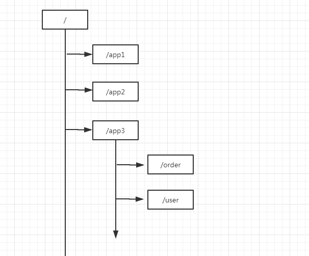
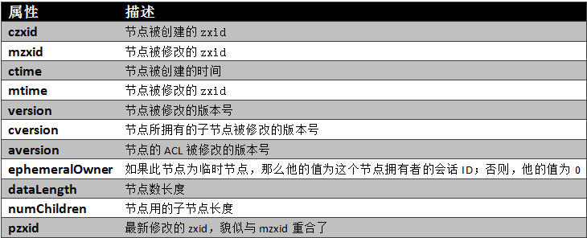
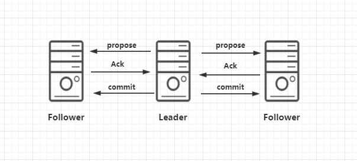

# 分布式服务协调-Zookeeper

[Zookeeper官网](https://archive.apache.org/)

## 什么是Zookeeper

​	zookeeper 是一个开源的分布式协调服务，由雅虎公司创建，是 google chubby 的开源实现。zookeeper 的设计目标是将哪些复杂且容易出错的分布式一致性服务封装起来，构成一个高效可靠的原语集（由若干条指令组成的，完成一定功能的一个过程），并且以一些列简单易用的接口提供给用户使用。

### Zookeeper数据结构

> Zookeeper数据结构图



> 数据结构特点

* zookeeper中的节点称为：znode
* 相同路径下节点唯一
* 节点Znode可以包含数据和子节点（但是EPHEMERAL类型的节点不能有子节点）
* Znode有两种类型：临时节点、持久节点
* 临时节点通过create -e 创建,临时节点在客户端断开一定时间后，会自动删除
* 持久节点通过create -s 创建 默认创建持久节点

## Zookeeper的安装部署

zookeeper服务命令

* sh zkServer.sh start 启动
* sh zkServer.sh status 查看状态
* sh zkServer.sh stop  停止
* sh zkServer.sh restart 重启
* sh zkCli.sh -timeout 0 -r -server ip:port  启动zk客户端

> Zookeeper下载

[Zookeeper下载地址](https://archive.apache.org/dist/zookeeper/zookeeper-3.4.10/zookeeper-3.4.10.tar.gz)

> 解压启动

```shell
tar -xvf zookeeper-3.4.10.tar.gz
mv zookeeper-3.4.10 /usr/local
cd /usr/local/zookeeper-3.4.10/conf
cp zoo_simple.cxf zoo.cxf
cd ../bin
sh zkServer.sh start #启动zookeepr
sh zkCli.sh #启动zookeeper客户端
```

> 连接Zookeeper客户端

```shell
[zk: localhost:2181(CONNECTED) 0] help
ZooKeeper -server host:port cmd args
        stat path [watch]
        set path data [version]
        ls path [watch]
        delquota [-n|-b] path
        ls2 path [watch]
        setAcl path acl
        setquota -n|-b val path
        history 
        redo cmdno
        printwatches on|off
        delete path [version]
        sync path
        listquota path
        rmr path
        get path [watch]
        create [-s] [-e] path data acl
        addauth scheme auth
        quit 
        getAcl path
        close 
        connect host:port
[zk: localhost:2181(CONNECTED) 1] 
```

### zookeeper集群配置

​	略，电脑不行不能搭建集群环境。

每个zookeeper的zoo.cxf配置文件中需要添加配置文件,集群建议最少3个节点，Follwer从节点

leader主节点,启动第一个节点时，报错，如果启动第二个节点还报错，可能是防火墙没有关闭。

observe观察者，只同步数据，不参与选举，

```cxf
#server.id=ip:port:port
server.1=192.168.10.11:2888:3888
server.2=192.168.10.12:2888:3888
server.3=192.168.10.13:2888:3888
server.4=192.168.10.14:2888:3888:observe ## 设置节点为观察者
```

> server.A=B：C：D：其 中

* A 是一个数字，表示这个是第几号服务器；
* B 是这个服务器的 ip 地址；
* C 表示的是这个服务器与集群中的 Leader
  服务器交换信息的端口；
* D 表示的是万一集群中的 Leader 服务器挂了，需要一个端口来重新进行选举，选出一个新的 Leader，而这个端口就是用来执行选举时服务器相互通信的端口。

​	如果是伪集群的配置方式，由于 B 都是一样，所以不同的 Zookeeper 实例通信端口号不能一样，所以要给它们分配不同的端口号。

在dataDir目录下创建myid文件，并且把ip对于的server.id的id值，写入到myid文件中

例如：192.168.10.11 的myid

```
1
```

192.168.10.13 的myid

```
3
```

> zookeeper端口说明

* 2181：对客户端提供服务
* 2888：集群内节点通讯使用(选举Leader监听次端口)
* 3888：选举leader使用

### Zookeeper节点状态

ZK Service：服务器集群

> Leader 服务器是整个 zookeeper 集群的核心，主要的工作任务有两项

1. 事物请求的唯一调度和处理者，保证集群事物处理的顺
    序性
2. 集群内部各服务器的调度者

> Follower 角色的主要职责是

1. 处理客户端非事物请求、转发事物请求给 leader 服务器
2. 参与事物请求 Proposal 的投票（需要半数以上服务器
    通过才能通知 leader commit 数据; Leader 发起的提案，
    要求 Follower 投票）
3. 参与 Leader 选举的投票

> Observer角色的主要职责是为了提供读取速度

 	1. 接收客户端的请求，将写请求转发给Leader，
 	2. Observe不参与投票，只同步leader状态，
 	3. 目的是为了提高读取速度

## Zookeeper常用的命令

> 创建节点

```shell
[zk: localhost:2181(CONNECTED) 0] create /order-service 0
Created /order-service
[zk: localhost:2181(CONNECTED) 1] create /order-service/wsdl 1
Created /order-service/wsdl
```

* 同级节点的唯一性
* create -e 创建临时节点
* 有序节点和无序节点
* 临时节点和持久节点(在客户端建立的时候)
* 临时节点下不能有子节点
* 节点存在父子关系，有先后，如果需要删除父节点，那么必须把该节点下的子节点删除完后，才能删除该节点

> 获取节点值

```shell
[zk: localhost:2181(CONNECTED) 0] get /order-service/wsdl
1
cZxid = 0x9
ctime = Mon Dec 31 23:32:06 CST 2018
mZxid = 0x9
mtime = Mon Dec 31 23:32:06 CST 2018
pZxid = 0x9
cversion = 0
dataVersion = 0
aclVersion = 0
ephemeralOwner = 0x0
dataLength = 1
numChildren = 0
```

* cZxid: 是节点的创建时间所对应的Zxid格式时间戳
* mZxid:是节点的修改时间所对应的Zxid格式时间戳
* pZxid: 
* cversion:  子节点版本号
* dataVersion: 节点数据版本号
* aclVersion: 节点所拥有的ACL版本号(ACL权限控制CREATE、DELETE、READ、WRITE、ADMIN)



> 删除节点

```shell
[zk: localhost:2181(CONNECTED) 3] delete /order-service
Node not empty: /order-service
[zk: localhost:2181(CONNECTED) 4] delete /order-service/wsdl
[zk: localhost:2181(CONNECTED) 5] 
```

* 删除的节点必须不包含子节点，不然删除失败: Node not empty
* 删除成功后，是没有任何提示的《no news is good news》

> 查看目录下的所有节点ls dir

```shell
[zk: localhost:2181(CONNECTED) 0] ls /
[order-service, zookeeper]
```


## Zookeeper配置解读

### zoo.cfg

​	zookeeper解压后在conf目录下只存在zoo_simple.cfg文件，需要把执行: cp zoo_simple.cfg zoo.cfg

​	zoo.cfg 是zookeeper的配置文件

#### dataDir

dataDir配置了zookeeper数据的存在位置，在该目录下存在版本号文件,集群的myid存放位置，不推荐放在/tmp/zookeeper临时目录中，推荐放入到高速磁盘中，提供访问速度.


	#### tickTime

时间单位: 默认2秒

#### initLimit

初始化时间: 默认10个tickTime

#### syncLimit

同步时间:默认5个tickTime

#### cliendPort

zk客户端的端口，默认是2181


#### 集群配置

```:portugal:
#server.id=ip:port:port
server.1=192.168.10.11:2888:3888
server.2=192.168.10.12:2888:3888
server.3=192.168.10.13:2888:3888
```

参考《zookeeper的安装部署->zookeeper集群配置章节》


## Zookeeper应用场景

[参考文章《[【分布式】Zookeeper应用场景](https://www.cnblogs.com/leesf456/p/6036548.html)》](https://www.cnblogs.com/leesf456/p/6036548.html)


### 数据发布、订阅

### 负载均衡

### 命名服务

### 分布式协调/通知

### 集群管理

### Master选举

### 分布式锁

### 分布式队列

### 注册中心


## Zookeeper设计猜想

1. 防止单点故障（集群方案leader，follwer），还能分担请求
2. 数据的一致性(每个节点的数据保持一致性)

## ZAB 协议

​	ZAB（Zookeeper Atomic Broadcast） 协议是为分布式协调服务 ZooKeeper 专门设计的一种支持崩溃恢复的原子广播协议。在 ZooKeeper 中，主要依赖 ZAB 协议来实现分布式数据一致性，基于该协议，ZooKeeper 实现了一种主备模式的系统架构来保持集群中各个副本之间的数据一致性。

### zab 协议介绍 

ZAB 协议包含两种基本模式，分别是

1. 崩溃恢复

   ​	当整个集群在启动时，或者当 leader 节点出现网络中断、崩溃等情况时，ZAB 协议就会进入恢复模式并选举产生新的 Leader，当 leader 服务器选举出来后，并且集群中有过半的机器和该 leader 节点完成数据同步后（同步指的是数据同步，用来保证集群中过半的机器能够和 leader 服务器的数据状态保持一致），ZAB 协议就会退出恢复模式。

2. 原子广播

  ​	当集群中已经有过半的 Follower 节点完成了和 Leader 状态同步以后，那么整个集群就进入了消息广播模式。这个时候，在 Leader 节点正常工作时，启动一台新的服务器加入到集群，那这个服务器会直接进入数据恢复模式，和leader 节点进行数据同步。同步完成后即可正常对外提供非事务请求的处理。

### 消息广播的实现原理 

> 简化版本的二阶段提交过程

1. leader 接收到消息请求后，将消息赋予一个全局唯一的64 位自增 id，叫：zxid，通过 zxid 的大小比较既可以实现因果有序这个特征

2. leader 为每个 follower 准备了一个 FIFO 队列（通过 TCP协议来实现，以实现了全局有序这一个特点）将带有 zxid的消息作为一个提案（proposal）分发给所有的follower

3. 当 follower 接收到 proposal，先把 proposal 写到磁盘，写入成功以后再向 leader 回复一个 ack

4. 当 leader 接收到合法数量（超过半数节点）的 ACK 后，leader 就会向这些 follower 发送 commit 命令，同时会在本地执行该消息

5. 当 followe收到消息的 commit 命令以后，会提交该消息

  

  	**leader 的投票过程，不需要 Observer 的 ack，也就是Observer 不需要参与投票过程，但是 Observer 必须要同步 Leader 的数据从而在处理请求的时候保证数据的一致性**

