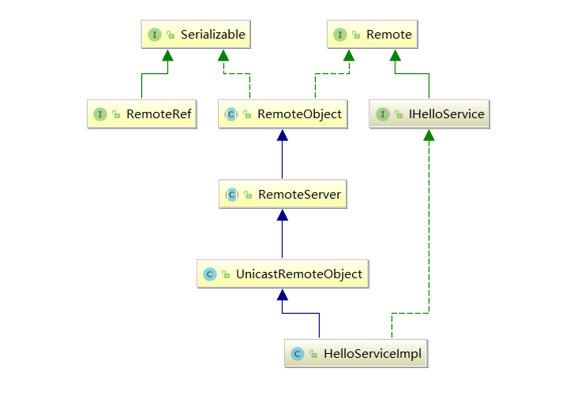
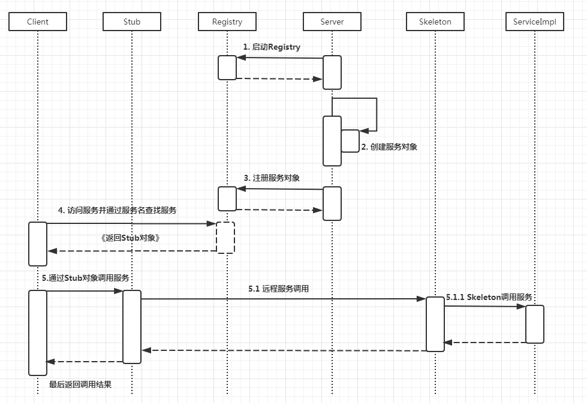

# 分布式架构-RPC

## 什么是RPC

​	RPC(Remote Procedure Call)远程服务调用，一般用来实现部署在不同的机器上的系统之间的方法调用，是的程序能够像访问本地方法一样，通过网络传输去访问远程端系统资源；对于客户端来说，传输层使用什么协议，序列化和反序列化都是透明的。

​	Dubbo是基于RPC通信的。

## RPC框架原理

​	

## 了解JAVA RMI

​	JAVA RMI （JAVA Remote Method Invocation）是基于java的远程方法调用，是纯java的网络分布式应用系统的核心解决方案之一。

​	RMI目前使用Java远程消息交换协议JRMP(JAVA Remote Message protocol)进行通信，由于JRMP是专门为Java对象制定的，是纯Java分布式应用系统的解决方案。

​	RMI是专为java语言设计的远程调用框架，所有对其他语言支持不足。

## 基于JAVA RMI实践

### 服务端代码

> 远程调用接口-IHelloService

```java
import java.rmi.Remote;
import java.rmi.RemoteException;

/**
 * @author king-pan
 * @date 2018/12/28
 * @Description 远程调用接口,需要继承Remote
 */
public interface IHelloService extends Remote {

    String sayHello(String name) throws RemoteException;
}
```

> 远程调用实现类-HelloServiceImpl

```java
import java.rmi.RemoteException;
import java.rmi.server.UnicastRemoteObject;
import java.util.Date;

/**
 * @author king-pan
 * @date 2018/12/28
 * @Description 远程调用实现,需要继承UnicastRemoteObject，并且构造器上必须抛出RemoteException异常
 */
public class HelloServiceImpl extends UnicastRemoteObject implements IHelloService {

    protected HelloServiceImpl() throws RemoteException {
        super();
    }

    @Override
    public String sayHello(String name) throws RemoteException {
        return "Hello " + name + ",now:" + new Date();
    }
}
```

构造器上必须抛出异常的原因：父类无参构造器中抛出了RemoteException异常

```java
 protected UnicastRemoteObject() throws RemoteException
 {
    this(0);
 }
```

> 发布服务-Server

```java
import java.net.MalformedURLException;
import java.rmi.Naming;
import java.rmi.RemoteException;
import java.rmi.registry.LocateRegistry;

/**
 * @author king-pan
 * @date 2018/12/28
 * @Description 发布服务
 */
public class Server {

    public static void main(String[] args) {
        try {
            //创建需要发布的远程对象
            IHelloService helloService = new HelloServiceImpl();
            //注册端口-必须是1099
            LocateRegistry.createRegistry(1099);
            //注册中心,key-value形式
            Naming.rebind("rmi://127.0.0.1/Hello", helloService);

            System.out.println("服务启动成功");
        } catch (RemoteException e) {
            e.printStackTrace();
        } catch (MalformedURLException e) {
            e.printStackTrace();
        }
    }
}
```

### 客户端实现

> 客户端代码-ClientDemo

```java
import club.javalearn.rmiserver.IHelloService;

import java.net.MalformedURLException;
import java.rmi.Naming;
import java.rmi.NotBoundException;
import java.rmi.RemoteException;

/**
 * @author king-pan
 * @date 2018/12/28
 * @Description 客户端测试代码
 */
public class ClientDemo {
    public static void main(String[] args) {
        try {
            IHelloService helloService = (IHelloService) Naming.lookup("rmi://127.0.0.1/Hello");
            System.out.println(helloService.sayHello("King-pan"));
        } catch (NotBoundException e) {
            e.printStackTrace();
        } catch (MalformedURLException e) {
            e.printStackTrace();
        } catch (RemoteException e) {
            e.printStackTrace();
        }
    }
}
```

### RMI通信原理分析

#### 远程调用对象类图





sun.rmi.server.UnicastServerRef#exportObject(java.rmi.Remote, java.lang.Object, boolean)


```java
 public Remote exportObject(Remote var1, Object var2, boolean var3) throws RemoteException {
        Class var4 = var1.getClass();

        Remote var5;
        try {
            //对HelloServiceImpl进行代理
            var5 = Util.createProxy(var4, this.getClientRef(), this.forceStubUse);
        } catch (IllegalArgumentException var7) {
            throw new ExportException("remote object implements illegal remote interface", var7);
        }

        if (var5 instanceof RemoteStub) {
            this.setSkeleton(var1);
        }
		//包装成一个暴露在TCP端口上的对象
        Target var6 = new Target(var1, this, var5, this.ref.getObjID(), var3);
        this.ref.exportObject(var6);
        this.hashToMethod_Map = (Map)hashToMethod_Maps.get(var4);
        return var5;
    }
```

> 服务端启动Registry过程

```java
 //注册端口-必须是1099
LocateRegistry.createRegistry(1099);
//注册中心,key-value形式,暴露rmi接口名称，通过接口名称客户端可以调用服务端对象方法
Naming.rebind("rmi://127.0.0.1/Hello", helloService);
```

$2222

```java
private void listen() throws RemoteException {
        assert Thread.holdsLock(this);

        TCPEndpoint var1 = this.getEndpoint();
        int var2 = var1.getPort();
        if (this.server == null) {
            if (tcpLog.isLoggable(Log.BRIEF)) {
                tcpLog.log(Log.BRIEF, "(port " + var2 + ") create server socket");
            }

            try {
                this.server = var1.newServerSocket();
                Thread var3 = (Thread)AccessController.doPrivileged(new NewThreadAction(new TCPTransport.AcceptLoop(this.server), "TCP Accept-" + var2, true));
                var3.start();
            } catch (BindException var4) {
                throw new ExportException("Port already in use: " + var2, var4);
            } catch (IOException var5) {
                throw new ExportException("Listen failed on port: " + var2, var5);
            }
        } else {
            SecurityManager var6 = System.getSecurityManager();
            if (var6 != null) {
                var6.checkListen(var2);
            }
        }

    }
```


#### 启动服务端监听

```java
private class AcceptLoop implements Runnable {
        private final ServerSocket serverSocket;
        private long lastExceptionTime = 0L;
        private int recentExceptionCount;

        AcceptLoop(ServerSocket var2) {
            this.serverSocket = var2;
        }

        public void run() {
            try {
                this.executeAcceptLoop();
            } finally {
                try {
                    this.serverSocket.close();
                } catch (IOException var7) {
                }

            }

        }

        private void executeAcceptLoop() {
            if (TCPTransport.tcpLog.isLoggable(Log.BRIEF)) {
                TCPTransport.tcpLog.log(Log.BRIEF, "listening on port " + TCPTransport.this.getEndpoint().getPort());
            }

            while(true) {
                Socket var1 = null;

                try {
                    var1 = this.serverSocket.accept();
                    InetAddress var16 = var1.getInetAddress();
                    String var3 = var16 != null ? var16.getHostAddress() : "0.0.0.0";

                    try {
                        TCPTransport.connectionThreadPool.execute(TCPTransport.this.new ConnectionHandler(var1, var3));
                    } catch (RejectedExecutionException var11) {
                        TCPTransport.closeSocket(var1);
                        TCPTransport.tcpLog.log(Log.BRIEF, "rejected connection from " + var3);
                    }
                } catch (Throwable var15) {
                    Throwable var2 = var15;

                    try {
                        if (this.serverSocket.isClosed()) {
                            return;
                        }

                        try {
                            if (TCPTransport.tcpLog.isLoggable(Level.WARNING)) {
                                TCPTransport.tcpLog.log(Level.WARNING, "accept loop for " + this.serverSocket + " throws", var2);
                            }
                        } catch (Throwable var13) {
                        }
                    } finally {
                        if (var1 != null) {
                            TCPTransport.closeSocket(var1);
                        }

                    }

                    if (!(var15 instanceof SecurityException)) {
                        try {
                            TCPEndpoint.shedConnectionCaches();
                        } catch (Throwable var12) {
                        }
                    }

                    if (!(var15 instanceof Exception) && !(var15 instanceof OutOfMemoryError) && !(var15 instanceof NoClassDefFoundError)) {
                        if (var15 instanceof Error) {
                            throw (Error)var15;
                        }

                        throw new UndeclaredThrowableException(var15);
                    }

                    if (!this.continueAfterAcceptFailure(var15)) {
                        return;
                    }
                }
            }
        }
}
```


#### RMI远程调用时序图



## 实现自己的RPC框架

### 服务端代码

> RpcRequest

```java
import lombok.Data;

import java.io.Serializable;

/**
 * @author king-pan
 */
@Data
public class RpcRequest implements Serializable {
    private static final long serialVersionUID = 1L;
    private String className;
    private String methodName;
    private Object[] parameters;
}
```

> ProcessorHandler发布一个scoket供客户端调用,与RMI的AcceptLoop类功能相似

```java
import java.io.IOException;
import java.io.ObjectInputStream;
import java.io.ObjectOutputStream;
import java.lang.reflect.InvocationTargetException;
import java.lang.reflect.Method;
import java.net.Socket;
/**
 * @author king-pan
 */
public class ProcessorHandler implements Runnable {
    private Socket socket;
    /**
     * 服务端发布的服务
     */
    private Object service;

    public ProcessorHandler(Socket socket, Object service) {
        this.socket = socket;
        this.service = service;
    }

    @Override
    public void run() {
        //处理请求
        ObjectInputStream inputStream = null;
        try {
            //获取客户端的输入流
            inputStream = new ObjectInputStream(socket.getInputStream());
            //反序列化远程传输的对象RpcRequest
            RpcRequest request = (RpcRequest) inputStream.readObject();
            //通过反射去调用本地的方法
            Object result = invoke(request);
            //通过输出流讲结果输出给客户端
            ObjectOutputStream outputStream = new ObjectOutputStream(socket.getOutputStream());
            outputStream.writeObject(result);
            outputStream.flush();
            inputStream.close();
            outputStream.close();
        } catch (Exception e) {
            e.printStackTrace();
        } finally {
            if (inputStream != null) {
                try {
                    inputStream.close();
                } catch (IOException e) {
                    e.printStackTrace();
                }
            }
        }
    }

    private Object invoke(RpcRequest request) throws InvocationTargetException, IllegalAccessException, NoSuchMethodException {
        //一下均为反射操作，目的是通过反射调用服务
        Object[] args = request.getParameters();
        Class<?>[] types = new Class[args.length];
        for (int i = 0; i < args.length; i++) {
            types[i] = args[i].getClass();
        }
        Method method = service.getClass().getMethod(request.getMethodName(), types);
        return method.invoke(service, args);
    }

}
```


> RpcServer发布远程服务，与AcceptLoop类的功能类似

```java

import java.io.IOException;
import java.net.ServerSocket;
import java.net.Socket;
import java.util.concurrent.ExecutorService;
import java.util.concurrent.Executors;

/**
 * @author king-pan
 * 用于发布一个远程服务
 */
public class RpcServer {
    /**
     * 创建一个线程池
     */
    private static final ExecutorService executorService = Executors.newCachedThreadPool();

    public void publisher(final Object service, int port) {
        ServerSocket serverSocket = null;
        try {
            //启动一个服务监听
            serverSocket = new ServerSocket(port);

            //循环监听
            while (true) {
                //监听服务
                Socket socket = serverSocket.accept();
                //通过线程池去处理请求
                executorService.execute(new ProcessorHandler(socket, service));
            }
        } catch (IOException e) {
            e.printStackTrace();
        } finally {
            if (serverSocket != null) {
                try {
                    serverSocket.close();
                } catch (IOException e) {
                    e.printStackTrace();
                }
            }

        }
    }

}
```

> 远程调用接口

```java
/**
 * @author king-pan
 */
public interface IRpcHello {
    String  sayHello(String name);
}
```

> 远程调用接口实现类

```java

/**
 * @author king-pan
 */
public class RpcHelloImpl implements IRpcHello {
    @Override
    public String sayHello(String name) {
        return "Hello :" + name;
    }
}
```

> 服务端测试代码

```java
/**
 * @author king-pan
 */
public class ServerDemo {

    public static void main(String[] args) {
        //创建一个远程调用对象
        IRpcHello rpcHello = new RpcHelloImpl();
        //创建一个发布远程调用服务的对象
        RpcServer rpcServer = new RpcServer();
        //把远程对象发布出去
        rpcServer.publisher(rpcHello,8088);
    }
}
```

### 客户端代码

> IRpcHello代码同服务端

> RpcRequest代码同服务端

> RemoteInvocationHandler

```java

import club.javalearn.rmiserver.rpc.RpcRequest;

import java.lang.reflect.InvocationHandler;
import java.lang.reflect.Method;

/**
 * @author king-pan
 *  实现调用远程服务的方法
 */
public class RemoteInvocationHandler implements InvocationHandler {
    private String host;
    private int port;

    public RemoteInvocationHandler(String host, int port) {
        this.host = host;
        this.port = port;
    }

    @Override
    public Object invoke(Object proxy, Method method, Object[] args) throws Throwable {
        //组装请求
        RpcRequest request = new RpcRequest();
        request.setClassName(method.getDeclaringClass().getName());
        request.setMethodName(method.getName());
        request.setParameters(args);
        //通过tcp传输协议进行传输
        TCPTransport tcpTransport = new TCPTransport(this.host, this.port);
        //发送请求
        return tcpTransport.send(request);
    }
}
```

> TCPTransport功能同RMI的TCPTransport

```java

import club.javalearn.rmiserver.rpc.RpcRequest;

import java.io.IOException;
import java.io.ObjectInputStream;
import java.io.ObjectOutputStream;
import java.net.Socket;

/**
 * @author king-pan
 * 连接远程发布的ServerSocket
 */
public class TCPTransport {
    private String host;

    private int port;

    public TCPTransport(String host, int port) {
        this.host = host;
        this.port = port;
    }

    //创建一个socket连接
    private Socket newSocket() {
        System.out.println("创建一个新的连接");
        Socket socket;
        try {
            socket = new Socket(host, port);
            return socket;
        } catch (Exception e) {
            throw new RuntimeException("连接建立失败");
        }
    }

    public Object send(RpcRequest request) {
        Socket socket = null;
        try {
            socket = newSocket();
            //获取输出流，将客户端需要调用的远程方法参数request发送给
            ObjectOutputStream outputStream = new ObjectOutputStream
                    (socket.getOutputStream());
            outputStream.writeObject(request);
            outputStream.flush();
            //获取输入流，得到服务端的返回结果
            ObjectInputStream inputStream = new ObjectInputStream
                    (socket.getInputStream());
            Object result = inputStream.readObject();
            inputStream.close();
            outputStream.close();
            return result;

        } catch (Exception e) {
            throw new RuntimeException("发起远程调用异常:", e);
        } finally {
            if (socket != null) {
                try {
                    socket.close();
                } catch (IOException e) {
                    e.printStackTrace();
                }
            }
        }
    }

}
```

> 客户端测试代码ClientDemo

```java
/**
 * @author king-pan
 */
public class ClientDemo {

    public static void main(String[] args) {
        RpcClientProxy rpcClientProxy = new RpcClientProxy();

        IRpcHello hello = rpcClientProxy.clientProxy
                (IRpcHello.class, "localhost", 8088);
        System.out.println(hello.sayHello("mic"));

    }
}
```


