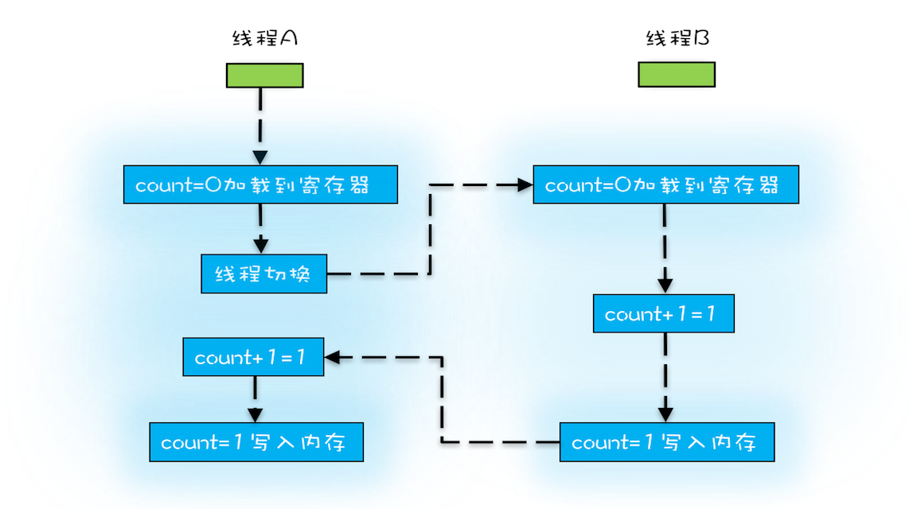

# 02-并发编程核心问题

## 硬件性能瓶颈

​	这些年，我们的CPU、内存、I/O设备都在不断迭代，不断朝着更快的方向努力。但是在这个快速过程中，又一个核心矛盾一直存在，就是这三者的速度差异。CPU和内存的速度差异可以形象地描述为:CPU是天上一天，内存是地上一年(假设CPU执行一条普通指令需要一天，那么CPU读写内存得等待一年的时间)。内存和I/O设备的速度差异就更大了，内存是天上一天，I/O设备是地上十年。

​	程序里大部分语句都要访问内存，有些还要访问I/O，根据木桶理论在（一只水桶能装多少水取决于它最短的那块木板），程序整体的性能取决于最慢的操作----读写I/O设备，也就是说单方面提高CPU性能是无效的。

​	为了合理利用CPU的高性能，平衡这三者的速度差异，计算机体系结构，操作系统，编译程序都做出了贡献，主要体现为:

	1. CPU增加了缓存，以均衡与内存的速度差异；
 	2. 操作系统增加了进程、线程、以分时复用CPU，进而均衡CPU与I/O设备的速度差异；
 	3. 编译程序优化执行执行次序，使用缓存能够更加合理地利用。

现在我们几乎所有的程序都默默地享受着这些成功，但是天下没有免费的午餐，并发程序很多诡异问题的根源也在这里。

## 源头之一: 缓存导致的可见性问题


​	在单核时代，所有的线程都是在一颗CPU上执行，CPU缓存与内存的数据一致性容易解决，因为所有线程都是操作同一个CPU的缓存，一个线程对缓存的写，对另外一个线程来说一定是可见的。例如下下图的途中，线程A和线程B都是操作同一个CPU里面的缓存，所以线程A更新了变量V的值，那么线程B之后再访问变更V，得到的一定是V的最新值(线程A最新的赋值)


​	***一个线程对共享变量的修改，另外一个线程能够立刻看到，我们称为==可见性==***

​	多核时代，每颗CPU都有自己的缓存，这时CPU缓存与内存的数据一致性就没那么容易解决了，当多个线程在不同的CPU上执行时，这些线程操作的是不同的CPU缓存。比如下图中，线程A操作的是CPU-1上的缓存，而线程B操作的是CPU-2上的缓存，很明显，这个时候线程A对变量V的操作对于线程B而言就不具备可见性了。这个就属于硬件程序员给软件程序员挖的“坑”。


```java
public static void main(String[] args) {
        MyData myData = new MyData();
        new Thread(() -> {
            System.out.println(Thread.currentThread().getName() + "\t come in.");
            try {
                TimeUnit.SECONDS.sleep(3);
            } catch (InterruptedException e) {
                e.printStackTrace();
            }
            myData.addTo10();
            System.out.println(Thread.currentThread().getName() + "\t end. value=" + myData.num);
        }).start();


        while (myData.num == 0) {

        }

        System.out.println(Thread.currentThread().getName() + "\t value=" + myData.num);

    }


class MyData {
    /**
     * 内存不可见
     */
    int num;

    public void addTo10() {
        this.num = 10;
    }
}
```


​	MyData的num初始化为0，main线程中启动一个线程调用Mydata的addTo10方法，main线程中while(myData.num==10){}死循环判断，然后main线程一直卡死在while这儿，证明新建的线程对num赋值，对于main线程是不可见的。

## 源头之二: 线程切换带来的原子性问题

​	由于IO太慢，早期的操作系统就发明了多进程，即使在单核的CPU上我们也可以一边听着歌一边写Bug，这个就是多进程的功能。

​	操作系统允许某个进程执行一小段时间，例如50毫秒，过了50毫秒操作提供就会重新选择一个进程来执行(我们称之为“任务切换”)，这个50毫秒称为"时间片"。


​	早期的操作系统基于进程来调度CPU，不同进程间是不共享内存空间的，所以进程要做任务切换基于要切换内存映射地址，而一个进程创建的所有线程，都是共享一个内存空间的，所以线程做任务切换成本就很底了。现代的操作系统都是基于更轻量的线程来调度，现在我们提到的"任务切换"都是指“线程切换”。

​	Java并发程序都是基于多线程的，自然也会涉及到任务切换，也许你想不到，任务切换竟然也是并发编程里诡异Bug源头之一。任务切换的时间大多数是在时间片结束的时候，我们现在基本都使用高级语言编程，高级语言里的一条语句往往需要多条CPU指令完成，例如上面代码中的count += 1,至少需要三条CPU指令。

* 指令一: 首先，需要把变量count从内存加载到CPU的寄存器；

* 指令二:之后，在寄存器中执行+1操作；

* 指令三:最后，将结果写入内存(缓存机制导致可能写入的是CUP缓存而不是内存)

  

​      操作系统做任务切换，可以发生在任务一条CPU指令执行完，使得，是CPU指令，而不是高级语言里的一条语句。对于上面的三条执行来说，我们假设count=0，如果线程A在执行1执行完后做线程切换，线程A和线程B按照下图的序列执行，那么我们会发现两个线程都执行了count += 1的操作，但是得到的结果不是我们期望的2，而是1。



在java中我们潜意识的认为count+=1这个操作是一个**==不可分割的整体==**,就像一个原子一样，线程的切换可以发生在count+=1之前，也可以发生在count+=1之后，但就是不会发生在中间。**==*我们把一个或者多个操作在CPU执行过程中不被中断的特性称为原子性==***

​	CPU能保证的原子操作时CPU指令级别的，而不是高级语言的操作符，这是违背我们直觉的地方。因此，很多时候我们需要在高级语言层面保证操作的原子性。

> 实例

* 在32位系统上对long类型进行加减乘除操作都会有线程安全问题，引起问题的主要原因时线程切换.
* 除了long型字段和double型字段外，java内存模型确保访问任意类型字段所对应的内存单元都是原子的。这包括引用其它对象的引用类型的字段。
* 此外，volatile long 和volatile double也具有原子性 。
* （虽然java内存模型不保证non-volatile long 和 non-volatile double的原子性，当然它们在某些场合也具有原子性。）（译注：non-volatile long在64位JVM，OS，CPU下具有原子性）
* 如果把一个字段声明为volatile型，线程对这个字段写入后，在执行后续的内存访问之前，线程必须刷新这个字段且让这个字段对其他线程可见（即该字段立即刷新）。每次对volatile字段的读访问，都要重新装载字段的值。


### 源头之三: 编译优化带来的有序性问题

​	并发编程里，编辑器为了优化性能，有时候会改变程序中语句的先后顺序例如程序中:"a=6;b=7";编译器优化后可能变成“b=7;a=6”,在这个例子中，编译器调整了语句的顺序，但是不影响程序的最终结果。不过有时候编译器以及解释器的优化可能导致意想不到的Bug

​	在Java领域一个经典的案例就是利用双重检查创建单例对象，例如下面的代码: 在获取实例getInstance()的方法中，我们首先判断instance是否为空，如果为空，则锁定Singleton.class并在此检查instance是否为空，如果还为空则创建Singleton的一个实例。

```java
public class Singleton {

    private static Singleton instance;

    private Singleton(){}

    public static Singleton getInstance(){
        if(instance == null){
            synchronized (Singleton.class){
                if(instance == null){
                    instance = new Singleton();
                }
            }
        }
        return instance;
    }

}
```

​	假设有两个线程A、B同时调用getInstance()方法，他们会同时发现instance==null,于是同时对Singleton.class加锁，此时JVM保证只有一个线程能够加锁成功(假设时线程A)，另外一个线程则会处于等待状态(假设时线程B);线程A会创建一个Singleton实例，之后释放锁，释放锁后，线程B被唤醒，线程B在次尝试加锁，此时是可以加锁成功的，加锁成功后，线程B检查instance == null 时会发现，已经创建过Singleton实例了，所以线程B不会再创建一个SIngleton实例。

​	这看上去一切很完美，无懈可击，但实际上getInstance()方法并不完美。问题出在哪儿呢？出在new操作上，我们以为的new操作应该是:

1. 分配一块内存M；
2. 在内存M上初始化Singleton对象；
3. 然后M的地址赋值给instance变量。

但是实际上优化后的执行路径却是这样的：

1. 分配一块内存M
2. 将M的地址赋值给instance变量
3. 最后在内存M上初始化Singleton对象。


  优化后会导致什么问题呢？我们假设线程A先执行getInstance()方法，当执行完指令2时恰好发生了线程切换，切换到了线程B上，如果此时线程B也主席那个getInstance()方法，那么线程B在执行第一个判断时会发现instance != null ，所以直接返回instance，而此时的instance是没有初始化过的，如果我们这个时候访问instance的成员变量就可能触发空指针异常。


## 总结

​	要写好并发程序，首先要知道并发程序的问题在哪儿，只有确定了”靶子“，才可能把问题解决，毕竟所有的解决方案都是针对问题的。并发编程经常出现的诡异问题看上去非常无厘头，但是深究的话，无外乎就是直觉欺骗了我们，**==只要我们能偶深刻理解可见性、原子性、有序性在并发场景下的原理，很多并发Bug都是可以理解、可以诊断的。==**

​	在介绍可见性、原子性、有序性的时候，我们知道***==缓存导致的可见性问题，线程切换带来的原子性问题，编译优化带来的有序性问题==***，其实缓存、线程切换、编译优化的目的和我们写并发程序的目的是相同的，都是提高程序性能。但是技术在解决一个问题的同时，必然会带来另外一个问题，所以在采**==用一项技术的同时，一定要清除它带了的问题是什么，以及如果规避、解决。==**

