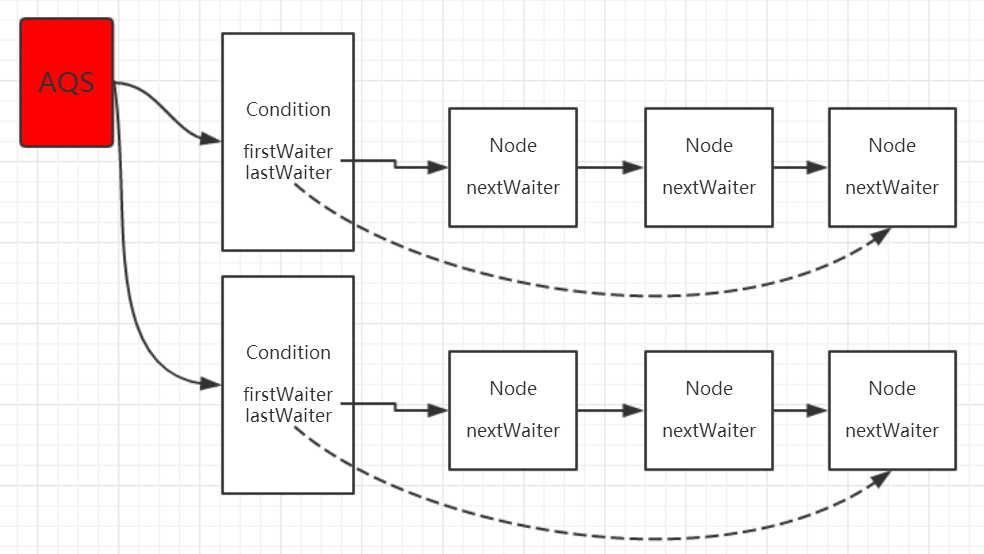

# Java多线程锁-Condition


## Condition接口

```java

package java.util.concurrent.locks;
import java.util.concurrent.TimeUnit;
import java.util.Date;

//jdk1.5新增
public interface Condition {
    
     //使当前线程加入 await() 等待队列中，并释放当锁，当其他线程调用signal()会重新请求锁。与Object.wait()类似。
    void await() throws InterruptedException;
    
   //调用该方法的前提是，当前线程已经成功获得与该条件对象绑定的重入锁，否则调用该方法时会抛出IllegalMonitorStateException。
    //调用该方法后，结束等待的唯一方法是其它线程调用该条件对象的signal()或signalALL()方法。等待过程中如果当前线程被中断，该方法仍然会继续等待，同时保留该线程的中断状态。 
    void awaitUninterruptibly();
    
     // 调用该方法的前提是，当前线程已经成功获得与该条件对象绑定的重入锁，否则调用该方法时会抛出IllegalMonitorStateException。
    //nanosTimeout指定该方法等待信号的的最大时间（单位为纳秒）。若指定时间内收到signal()或signalALL()则返回nanosTimeout减去已经等待的时间；
    //若指定时间内有其它线程中断该线程，则抛出InterruptedException并清除当前线程的打断状态；若指定时间内未收到通知，则返回0或负数。 
    long awaitNanos(long nanosTimeout) throws InterruptedException;

        //与await()基本一致，唯一不同点在于，指定时间之内没有收到signal()或signalALL()信号或者线程中断时该方法会返回false;其它情况返回true。
    boolean await(long time, TimeUnit unit) throws InterruptedException;

     //适用条件与行为与awaitNanos(long nanosTimeout)完全一样，唯一不同点在于它不是等待指定时间，而是等待由参数指定的某一时刻。
    boolean awaitUntil(Date deadline) throws InterruptedException;

    //唤醒一个在 await()等待队列中的线程。与Object.notify()相似
    void signal();
    
    //唤醒 await()等待队列中所有的线程。与object.notifyAll()相似
    void signalAll();
}
```

## Condition实现原理分析

​	Condition是在java 1.5中才出现的，它用来替代传统的Object的wait()、notify()实现线程间的协作，相比使用Object的wait()、notify()，使用Condition的await()、signal()这种方式实现线程间协作更加安全和高效。因此通常来说比较推荐使用Condition，阻塞队列实际上是使用了Condition来[模拟](https://www.baidu.com/s?wd=%E6%A8%A1%E6%8B%9F&tn=24004469_oem_dg&rsv_dl=gh_pl_sl_csd)线程间协作。

- Condition是个接口，基本的方法就是await()和signal()方法；
- Condition依赖于Lock接口，生成一个Condition的基本代码是lock.newCondition() 
- 调用Condition的await()和signal()方法，都必须在lock保护之内，就是说必须在lock.lock()和lock.unlock之间才可以使用
- Conditon中的await()对应Object的wait()；
- Condition中的signal()对应Object的notify()；
- Condition中的signalAll()对应Object的notifyAll()。


### 等待队列

​	要想能够深入的掌握condition还是应该知道它的实现原理，现在我们一起来看看condiiton的源码。创建一个condition对象是通过`lock.newCondition()`,而这个方法实际上是会new出一个**ConditionObject**对象，该类是AQS（[AQS的实现原理的文章](https://www.jianshu.com/p/cc308d82cc71)）的一个内部类，有兴趣可以去看看。前面我们说过，condition是要和lock配合使用的也就是condition和Lock是绑定在一起的，而lock的实现原理又依赖于AQS，自然而然ConditionObject作为AQS的一个内部类无可厚非。我们知道在锁机制的实现上，AQS内部维护了一个同步队列，如果是独占式锁的话，所有获取锁失败的线程的尾插入到**同步队列**，同样的，condition内部也是使用同样的方式，内部维护了一个 **等待队列**，所有调用condition.await方法的线程会加入到等待队列中，并且线程状态转换为等待状态。另外注意到ConditionObject中有两个成员变量：

```java
/** First node of condition queue. */
private transient Node firstWaiter;
/** Last node of condition queue. */
private transient Node lastWaiter;
```


​	condition维持着一个单向等待队列，我们也可以使用lock.newCondition()创建多个Condition对象，实现多个单向等待队列，也就是一个lock可以持有多个等待队列。

​	Object对象监视器上只能拥有一个同步队列和一个等待队列，而并发包中的Lock拥有一个同步队列和多个等待队列。

​	

​	如图所示，ConditionObject是AQS的内部类，因此每个ConditionObject能够访问到AQS提供的方法，相当于每个Condition都拥有所属同步器的引用。

### await实现原理


```java
public final void await() throws InterruptedException {
            if (Thread.interrupted())
                throw new InterruptedException();
            Node node = addConditionWaiter();
            long savedState = fullyRelease(node);
            int interruptMode = 0;
            while (!isOnSyncQueue(node)) {
                LockSupport.park(this);
                if ((interruptMode = checkInterruptWhileWaiting(node)) != 0)
                    break;
            }
            if (acquireQueued(node, savedState) && interruptMode != THROW_IE)
                interruptMode = REINTERRUPT;
            if (node.nextWaiter != null) // clean up if cancelled
                unlinkCancelledWaiters();
            if (interruptMode != 0)
                reportInterruptAfterWait(interruptMode);
        }
```


